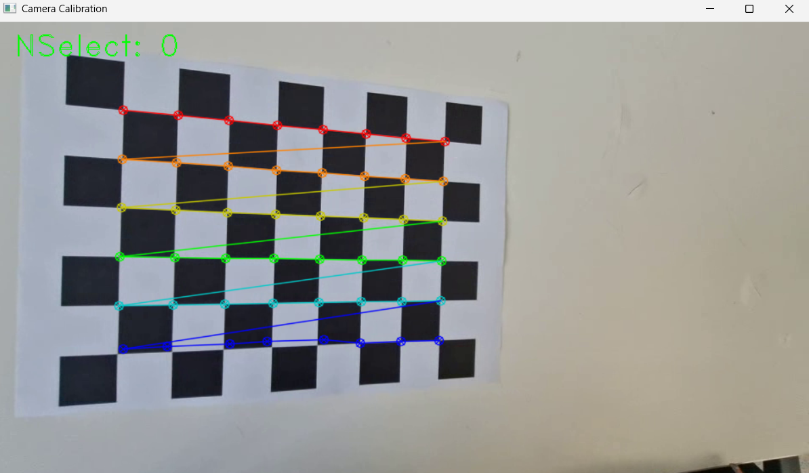
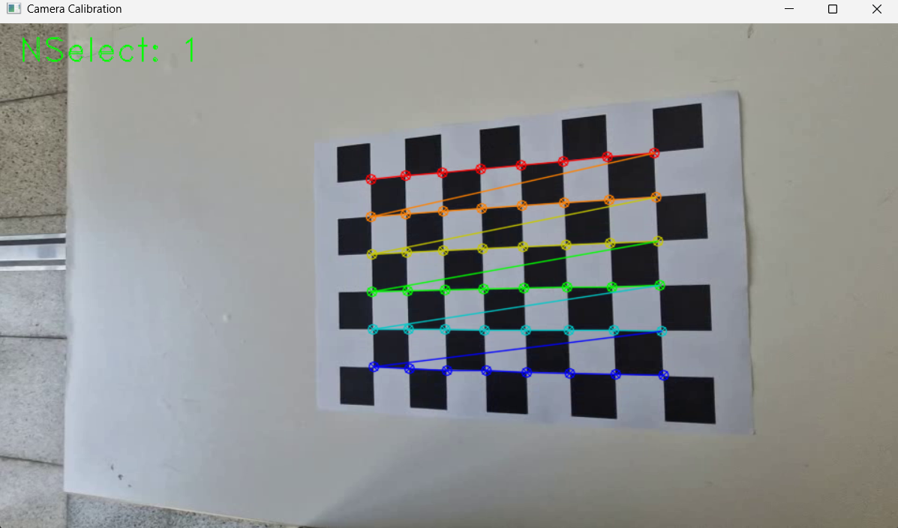
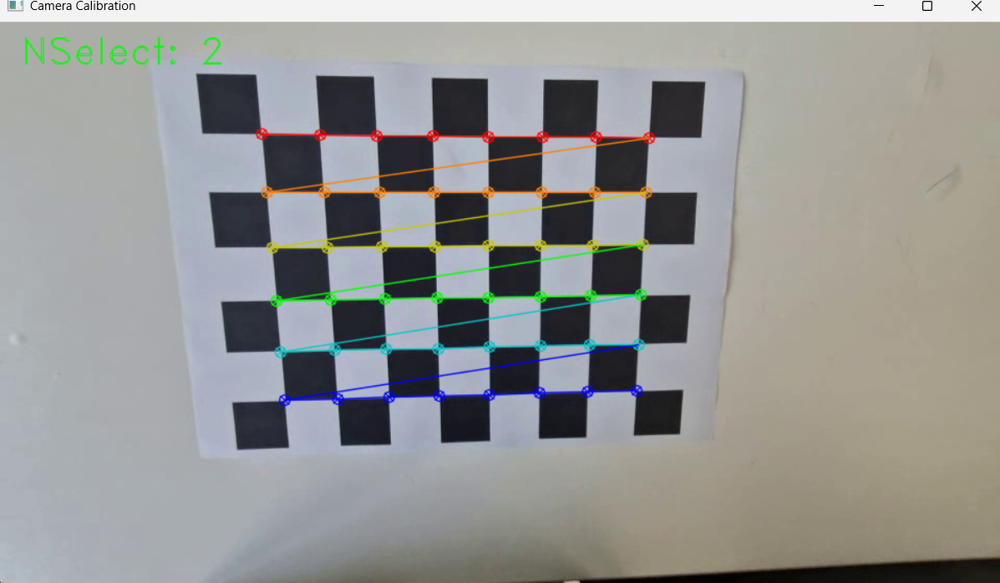
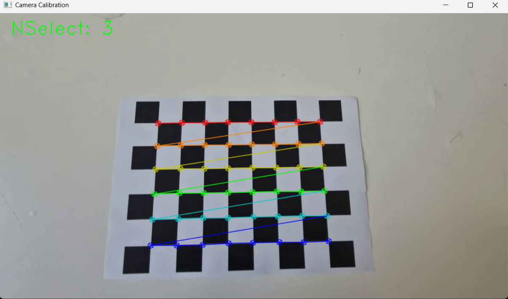

# OpenCV_Camera-Calibration
This is the camera calibration and distortion correction using open cv

## Camera Calibration Results

* **The number of selected images:** 4  
* **RMS error:** 1.3263262575554606  
* **Camera matrix (K):**

| | | |
|-|-|-|
|463.77380377|0|485.86564978|
|0|462.2257834|252.51163683|
|0|0|1|

### Distortion Coefficient

|k1|k1|p1|p2|k3|...|
|-|-|-|-|-|-|
|-1.2699291e-01|5.50924856e-01|-5.13339561e-03|-4.75228044e-04|-4.75228044e-04|

### Distortion Correction
* Camera Caliberation을 통해 얻은 카메라 행렬(K)과 왜곡 계수(distortion coefficient)를 기반으로 
cv.undistort(frame, K, dist_coeff) 함수를 적용하여 입력 영상의 렌즈 왜곡을 보정.
보정된 결과는 undistortedchessboard.mp4 파일로 생성. (newchessboard.mp4는 원본 영상)
* newchessboard.mp4 - 원본영상
* undistortedchessboard.mp4 - 4번 select 하여 원본을 수정한 영상
* 위의 결과 행렬과 왜곡 계수와는 달리 새로 45 select를 수행하여 원본을 수정한 영상

### ScreenShots
* Camera Caliberation Screenshots

### 한계점
* 이상하게 원래의 영상보다 오히려 왜곡되보임.
* selected를 45번 수행하여 새로운 비디오 newUndistortedchessboard.mp4로 확인하니 초반부분에서는 왜곡이 있지만
중반으로 갈수록 체스보드 내에서의 왜곡이 줄으듦.
* undistortedchessboard.mp4는 select한 횟수가 4번으로 비디오를 수정한 것.
